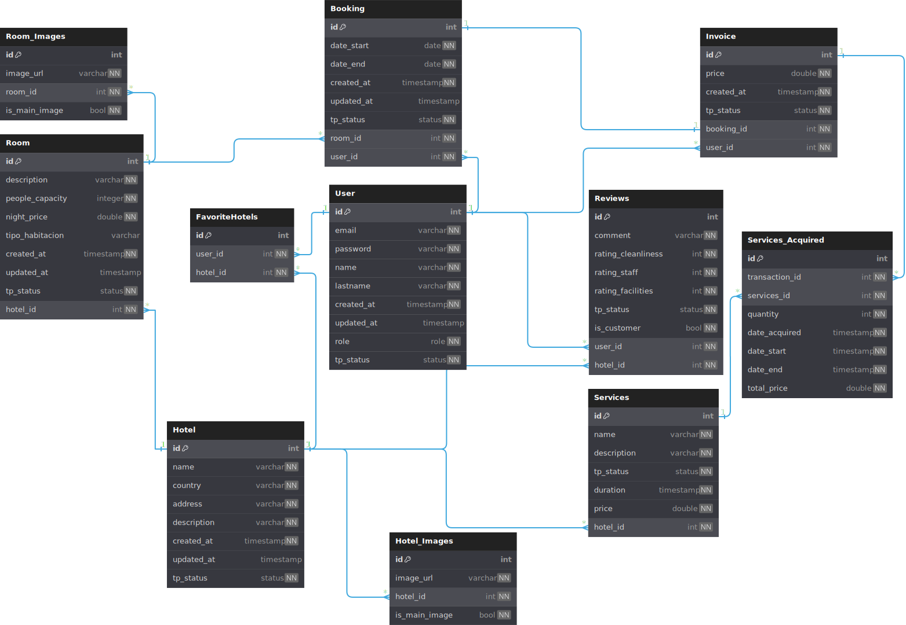

# *Entidad relación*

1. **Tabla `User`**:
   - Esta tabla almacena la información de los usuarios registrados en el sistema.
   - Campos:
     - `id`: Identificador único del usuario (clave primaria).
     - `email`: Correo electrónico del usuario (campo único).
     - `password`: Contraseña del usuario (almacenada de forma segura).
     - `name`, `lastname`: Nombre y apellido del usuario.
     - `created_at`, `updated_at`: Marcas de tiempo para el registro y la última actualización del usuario.
     - `role`: Indica el rol del usuario (`CLIENT`, `ADMIN_HOTEL`, `ADMIN_PLATFORM`).
     - `tp_status`: Estado del usuario (`ACTIVE`, `DELETED`, `BANNED`).
   - Índices:
     - Se crea un índice sobre el campo `email` para facilitar la búsqueda y autenticación de usuarios.

2. **Tabla `Hotel`**:
   - Esta tabla almacena la información de los hoteles registrados en el sistema.
   - Campos:
     - `id`: Identificador único del hotel (clave primaria).
     - `name`: Nombre del hotel.
     - `country`, `address`: Ubicación del hotel.
     - `description`: Descripción del hotel.
     - `created_at`, `updated_at`: Marcas de tiempo para el registro y la última actualización del hotel.
     - `tp_status`: Estado del hotel (`ACTIVE`, `DELETED`).

3. **Tabla `Hotel_Images`**:
   - Esta tabla almacena las imágenes asociadas a cada hotel.
   - Campos:
     - `id`: Identificador único de la imagen (clave primaria).
     - `image_url`: URL de la imagen del hotel.
     - `hotel_id`: Identifica a qué hotel pertenece la imagen (clave foránea).
     - `is_main_image`: Indica si la imagen es la principal o principal del hotel.
   - Índices:
     - Se crea un índice sobre el campo `hotel_id` para facilitar la búsqueda de imágenes por hotel.

4. **Tabla `Services`**:
   - Esta tabla almacena los servicios ofrecidos por los hoteles.
   - Campos:
     - `id`: Identificador único del servicio (clave primaria).
     - `name`: Nombre del servicio.
     - `description`: Descripción del servicio.
     - `tp_status`: Estado del servicio (`ACTIVE`, `DELETED`).
     - `duration`: Duración del servicio.
     - `price`: Precio del servicio.
     - `hotel_id`: Identifica a qué hotel pertenece el servicio (clave foránea).
   - Índices:
     - Se crea un índice sobre el campo `hotel_id` para facilitar la búsqueda de servicios por hotel.

5. **Tabla `Services_Acquired`**:
   - Esta tabla registra los detalles de los servicios adquiridos por los huéspedes durante su estadía.
   - Campos:
     - `id`: Identificador único de la adquisición de servicio (clave primaria).
     - `transaction_id`: Identifica a qué factura/transacción pertenece (clave foránea a la tabla `Invoice`).
     - `services_id`: Identifica qué servicio fue adquirido (clave foránea a la tabla `Services`).
     - `quantity`: Cantidad de veces que se adquirió el servicio.
     - `date_acquired`: Fecha en que se adquirió el servicio.
     - `date_start`, `date_end`: Fechas de inicio y fin del servicio adquirido.
     - `total_price`: Precio total pagado por el servicio.

6. **Tabla `Room`**:
   - Esta tabla almacena la información de las habitaciones disponibles en los hoteles.
   - Campos:
     - `id`: Identificador único de la habitación (clave primaria).
     - `description`: Descripción de la habitación.
     - `people_capacity`: Capacidad máxima de personas en la habitación.
     - `night_price`: Precio por noche de la habitación.
     - `tipo_habitacion`: Tipo de habitación (individual, doble, suite, etc.).
     - `created_at`, `updated_at`: Marcas de tiempo para el registro y la última actualización de la habitación.
     - `tp_status`: Estado de la habitación (`ACTIVE`, `DELETED`, `HIDDEN`).
     - `hotel_id`: Identifica a qué hotel pertenece la habitación (clave foránea).
   - Índices:
     - Se crea un índice sobre el campo `hotel_id` para facilitar la búsqueda de habitaciones por hotel.

7. **Tabla `Room_Images`**:
   - Esta tabla almacena las imágenes asociadas a cada habitación.
   - Campos:
     - `id`: Identificador único de la imagen (clave primaria).
     - `image_url`: URL de la imagen de la habitación.
     - `room_id`: Identifica a qué habitación pertenece la imagen (clave foránea).
     - `is_main_image`: Indica si la imagen es la principal o principal de la habitación.

8. **Tabla `Booking`**:
   - Esta tabla registra las reservas realizadas por los usuarios.
   - Campos:
     - `id`: Identificador único de la reserva (clave primaria).
     - `date_start`, `date_end`: Fechas de inicio y fin de la reserva.
     - `created_at`, `updated_at`: Marcas de tiempo para el registro y la última actualización de la reserva.
     - `tp_status`: Estado de la reserva (`ACTIVE`, `DELETED`).
     - `room_id`: Identifica la habitación reservada (clave foránea).
     - `user_id`: Identifica al usuario que realizó la reserva (clave foránea).

9. **Tabla `Invoice`**:
   - Esta tabla registra las facturas generadas por las reservas realizadas.
   - Campos:
     - `id`: Identificador único de la factura (clave primaria).
     - `price`: Precio total de la factura.
     - `created_at`: Marca de tiempo de la creación de la factura.
     - `tp_status`: Estado de la factura (`ACTIVE`, `DELETED`).
     - `booking_id`: Identifica a qué reserva pertenece la factura (clave foránea).
     - `user_id`: Identifica al usuario al que se le generó la factura (clave foránea).

10. **Tabla `FavoriteHotels`**:
    - Esta tabla almacena la información de los hoteles marcados como favoritos por los usuarios.
    - Campos:
      - `id`: Identificador único del registro de hotel favorito (clave primaria).
      - `user_id`: Identifica al usuario que ha marcado el hotel como favorito (clave foránea).
      - `hotel_id`: Identifica el hotel que se ha marcado como favorito (clave foránea).
    - Índices:
      - Se crea un índice sobre el campo `hotel_id` para facilitar la búsqueda de hoteles favoritos.

11. **Tabla `Reviews`**:
    - Esta tabla almacena las reseñas y calificaciones de los usuarios sobre los hoteles.
    - Campos:
      - `id`: Identificador único de la reseña (clave primaria).
      - `comment`: Comentario textual de la reseña.
      - `rating_cleanliness`, `rating_staff`, `rating_facilities`: Calificaciones detalladas sobre diferentes aspectos del hotel.
      - `tp_status`: Estado de la reseña (`ACTIVE`, `DELETED`, `HIDDEN`).
      - `is_customer`: Indica si el usuario que dejó la reseña realmente se alojó en el hotel.
      - `user_id`: Identifica al usuario que dejó la reseña (clave foránea).
      - `hotel_id`: Identifica el hotel al que pertenece la reseña (clave foránea).
    - Índices:
      - Se crea un índice sobre el campo `hotel_id` para facilitar la búsqueda de reseñas por hotel.

  

<details>
  <summary>Codigo DBML</summary>

  ```dbml
  // Use DBML to define your database structure
  // Docs: https://dbml.dbdiagram.io/docs

  Table User {
    id int [pk]
    email varchar [unique, not null]
    password varchar [not null]
    name varchar [not null]
    lastname varchar [not null]
    created_at timestamp [not null]
    updated_at timestamp
    role role [not null]
    tp_status status [not null]

    indexes {
      email
    }
  }

  Table Hotel {
    id int [pk]
    name varchar [not null]
    country varchar [not null]
    address varchar [not null]
    description varchar [not null]
    created_at timestamp [not null]
    updated_at timestamp
    tp_status status [not null]
  }

  table Hotel_Images {
    id int [pk]
    image_url varchar [not null]
    hotel_id int [ref: > Hotel.id, not null]
    is_main_image bool [not null]
    indexes {
      hotel_id
    }
    
  }

  Table Services {
    id int [pk]
    name varchar [unique, not null]
    description varchar [not null]
    tp_status status [not null]
    duration timestamp [not null]
    price double [not null]
    hotel_id int [ref: > Hotel.id, not null]

    indexes {
      hotel_id
    }
  }

  // basically Invoice details, but its mostly 
  // for services
  Table Services_Acquired {
    id int [pk]
    transaction_id int [ref: > Invoice.id, not null]
    services_id int [ref: > Services.id, not null]
    // cantidad de servicios `SEGUIDOS`
    // en caso de querer 2 en diferentes dias, 
    // crear 2 entries
    quantity int [not null]
    date_acquired timestamp [not null]
    date_start timestamp [not null]
    date_end timestamp [not null]
    total_price double [not null]
  }

  Table Room {
    id int [pk]
    description varchar [not null]
    people_capacity integer [not null]
    night_price double [not null]
    tipo_habitacion varchar
    created_at timestamp [not null]
    updated_at timestamp  
    tp_status status [not null]


    // relationships
    hotel_id int [ref: > Hotel.id, not null]

    indexes {
      hotel_id
    }
  }

  table Room_Images {
    id int [pk]
    image_url varchar [not null]
    room_id int [ref: > Room.id, not null]
    is_main_image bool [not null]
  }

  Table Booking {
    id int [pk]
    date_start date [not null]
    date_end date [not null]
    created_at timestamp [not null]
    updated_at timestamp 
    tp_status status [not null]

    // relationships
    room_id int [ref: > Room.id, not null]
    user_id int [ref: > User.id, not null]
  }


  table Invoice {
    id int [pk]
    price double [not null]
    created_at timestamp [not null]
    tp_status status [not null]

    // relationships
    booking_id int [ref: - Booking.id, not null]
    user_id int [ref: > User.id, not null]
  }

  Table FavoriteHotels {
    id int [pk]
    user_id int [ref: > User.id, not null]
    hotel_id int [ref: > Hotel.id, not null]

    indexes {
      hotel_id
    }
  }

  Table Reviews {
    id int [pk]
    comment varchar [not null]
    rating_cleanliness int [not null]
    rating_staff int [not null]
    rating_facilities int [not null]
    tp_status status [not null]
    is_customer bool [not null] // to check if actually used the room
    // relationships
    user_id int [ref: > User.id, not null]
    hotel_id int [ref: > Hotel.id, not null]

    indexes {
      hotel_id
    }
  }
  ```
</details>

## Possible entities

- Notifications
- ReviewsResponse
- Discounts
- SystemConfig
- Payments