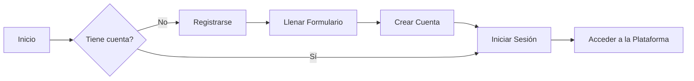
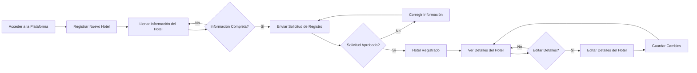
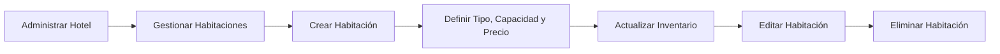
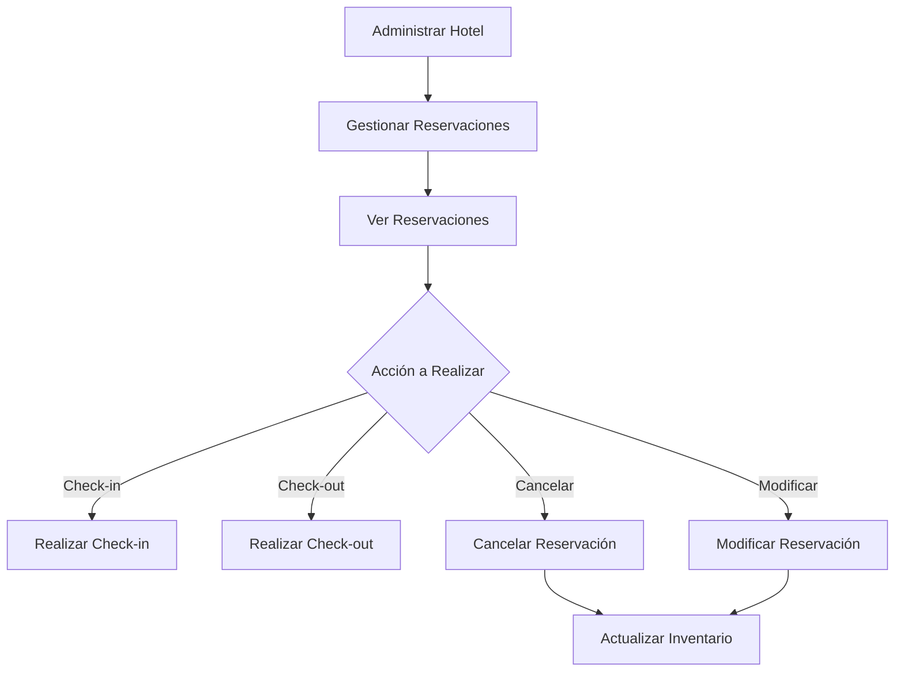
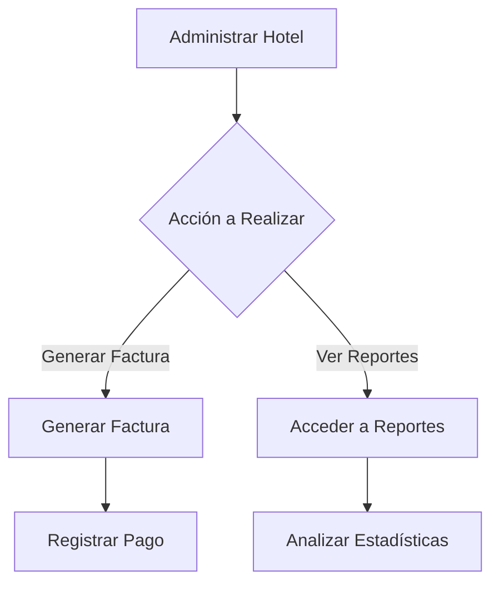
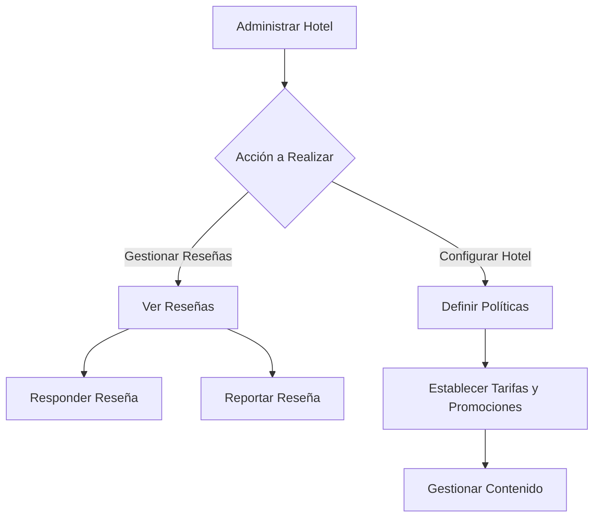

# Historia de Usuario: Usuario ADMIN_HOTEL

Como usuario `ADMIN_HOTEL`, quiero poder:

1. **Registrar y Administrar mi Hotel**
   - Crear una nueva cuenta de usuario llenando un formulario con mis datos personales y credenciales.
   - Registrar un nuevo hotel, proporcionando información detallada como nombre, dirección, categoría, servicios, instalaciones, etc.
   - Editar y actualizar la información de mi hotel en cualquier momento.

2. **Gestionar Habitaciones**
   - Crear, editar y eliminar diferentes tipos de habitaciones (individual, doble, suite, etc.) para mi hotel.
   - Definir la capacidad, precios y disponibilidad de cada tipo de habitación.
   - Actualizar el inventario de habitaciones disponibles en función de las reservaciones realizadas.

3. **Gestionar Reservaciones**
   - Acceder a una sección de "Reservaciones" donde pueda ver todas las reservaciones realizadas para mi hotel.
   - Ver detalles de cada reservación, incluyendo información del huésped, habitaciones reservadas, fechas, costo total, etc.
   - Realizar el check-in y check-out de huéspedes.
   - Cancelar o modificar reservaciones existentes (sujeto a políticas y restricciones).

4. **Generar Facturas**
   - Generar facturas detalladas para los huéspedes al finalizar su estadía.
   - Incluir cargos adicionales por servicios extras (si aplica).
   - Registrar pagos realizados por los huéspedes.

5. **Acceder a Reportes y Estadísticas**
   - Ver reportes y estadísticas sobre la ocupación de habitaciones, ingresos generados, reservaciones por periodo, etc.
   - Analizar tendencias y patrones de demanda para mi hotel.

6. **Gestionar Reseñas y Calificaciones**
   - Ver las reseñas y calificaciones dejadas por los huéspedes sobre mi hotel.
   - Responder a las reseñas y comentarios de los usuarios.
   - Reportar reseñas inapropiadas o engañosas.

7. **Configurar Políticas y Reglas de Negocio**
   - Definir políticas de cancelación, restricciones y reglas específicas para mi hotel.
   - Establecer tarifas, descuentos y promociones especiales.
   - Gestionar contenido e imágenes relacionadas con mi hotel.

Esta historia de usuario cubre las principales funcionalidades y el flujo de uso esperado para un usuario ADMIN_HOTEL en el Sistema de Gestión Hotelera. Incluye aspectos como el registro y administración del hotel, la gestión de habitaciones y reservaciones, la generación de facturas, el acceso a reportes y estadísticas, la gestión de reseñas y calificaciones, y la configuración de políticas y reglas de negocio específicas para el hotel.

Cada uno de estos puntos puede ser desglosado en tareas y requerimientos más específicos durante el proceso de diseño y desarrollo de la interfaz de usuario y las funcionalidades correspondientes al rol ADMIN_HOTEL.

## Diagrama de flujo

Claro, separaré los flujos del usuario `ADMIN_HOTEL` en diferentes diagramas utilizando Mermaid para una mejor explicación:

1. **Flujo de Registro y Administración del Hotel**:

Este diagrama muestra el flujo de registro e inicio de sesión para un `ADMIN_HOTEL`

2. **Flujo de Gestion de creacion de un hotel**

Este diagrama de flujo detalla los siguientes pasos para el registro y administración de un nuevo hotel por parte de un usuario ADMIN_HOTEL

3. **Flujo de Gestión de Habitaciones**:

En este diagrama, se detalla el flujo para la gestión de habitaciones de un hotel, incluyendo la creación, definición de detalles, actualización del inventario, edición y eliminación de habitaciones.

4. **Flujo de Gestión de Reservaciones**:

Este diagrama cubre el flujo de gestión de reservaciones para un `ADMIN_HOTEL`, incluyendo la visualización de reservaciones, la realización de check-in y check-out, la cancelación y modificación de reservaciones, y la actualización del inventario de habitaciones.

5. **Flujo de Generación de Facturas y Reportes**:

En este diagrama, se muestra el flujo para la generación de facturas después del check-out de un huésped, incluyendo el registro de pagos, así como el acceso a reportes y estadísticas para el análisis del rendimiento del hotel.

6. **Flujo de Gestión de Reseñas y Configuración**:

Este último diagrama cubre el flujo para la gestión de reseñas y calificaciones de los huéspedes, incluyendo la respuesta y reporte de reseñas, así como la configuración de políticas, tarifas, promociones y contenido relacionado con el hotel.

Estos diagramas proporcionan una representación visual de los diferentes flujos de trabajo y funcionalidades que un usuario `ADMIN_HOTEL` puede realizar en el Sistema de Gestión Hotelera. Cada diagrama se enfoca en un aspecto específico, lo que facilita la comprensión del flujo y puede ser útil para el diseño y desarrollo de la interfaz de usuario correspondiente.

