# Historia de Usuario: Usuario CLIENT

Como usuario `CLIENT`, quiero poder:

1. **Registrarme e Iniciar Sesión**
   - Crear una nueva cuenta de usuario llenando un formulario con mis datos personales y credenciales.
   - Iniciar sesión en la plataforma utilizando mis credenciales (correo electrónico y contraseña).

2. **Buscar y Explorar Hoteles**
   - Acceder a una página de búsqueda donde pueda ingresar criterios como ubicación, fechas de estadía, precios, servicios, etc.
   - Visualizar una lista de hoteles que coincidan con mis criterios de búsqueda.
   - Ver información detallada de cada hotel, incluyendo descripciones, imágenes, servicios, precios, calificaciones y reseñas.

3. **Reservar Habitaciones**
   - Seleccionar un hotel de mi interés y elegir las habitaciones disponibles según mis necesidades (tipo de habitación, capacidad, fechas).
   - Agregar habitaciones a un carrito de reserva y proceder al proceso de pago.
   - Visualizar un resumen de la reservación con los detalles y el costo total.
   - Completar el proceso de pago simulado (ingresando información de pago ficticia).

4. **Gestionar Reservaciones**
   - Acceder a una sección de "Mis Reservaciones" donde pueda ver el historial de reservaciones pasadas y futuras.
   - Cancelar o modificar reservaciones existentes (sujeto a políticas y restricciones).
   - Recibir notificaciones o actualizaciones sobre mis reservaciones.

5. **Agregar Hoteles a Favoritos**
   - Marcar hoteles como favoritos durante la búsqueda y exploración.
   - Acceder a una lista de hoteles favoritos en mi perfil de usuario.
   - Realizar reservaciones de manera más rápida y sencilla utilizando mis hoteles favoritos.

6. **Dejar Reseñas y Calificaciones**
   - Después de finalizar mi estadía, tener la opción de dejar una reseña y calificación sobre el hotel.
   - Ver las reseñas y calificaciones de otros usuarios al explorar hoteles.

7. **Editar Perfil de Usuario**
   - Actualizar mi información personal y preferencias en mi perfil de usuario.
   - Cambiar mi contraseña o información de contacto.

## Diagram

1. **Flujo de Registro e Inicio de Sesión**:

Este diagrama cubre el flujo de registro e inicio de sesión, donde el usuario puede crear una nueva cuenta llenando un formulario o iniciar sesión si ya tiene una cuenta existente.

2. **Flujo de Búsqueda y Selección de Hoteles**:

Este diagrama muestra el flujo para buscar y seleccionar un hotel, incluyendo la opción de aplicar filtros de búsqueda, ver los resultados, seleccionar un hotel específico, ver los detalles del hotel y finalmente iniciar el proceso de reserva de habitaciones.

3. **Flujo de Reserva y Pago**:

En este diagrama, se detalla el flujo de reserva de habitaciones, incluyendo la adición al carrito, la revisión del carrito, el proceso de pago con ingreso de datos de pago, la validación del pago y finalmente la confirmación de la reserva exitosa, lo que lleva al usuario a la gestión de reservaciones.

4. **Flujo de Gestión de Reservaciones**:

Este diagrama cubre el flujo de gestión de reservaciones, donde el usuario puede realizar acciones como agregar hoteles a favoritos, dejar reseñas y calificaciones, editar su información de perfil, y finalmente guardar los cambios realizados.

Esta historia de usuario cubre las principales funcionalidades y el flujo de uso esperado para un usuario `CLIENT` en el Sistema de Gestión Hotelera. Cada uno de estos puntos puede ser desglosado en tareas y requerimientos más específicos durante el proceso de diseño y desarrollo de la interfaz de usuario.